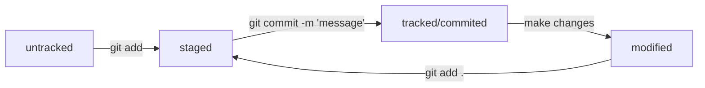
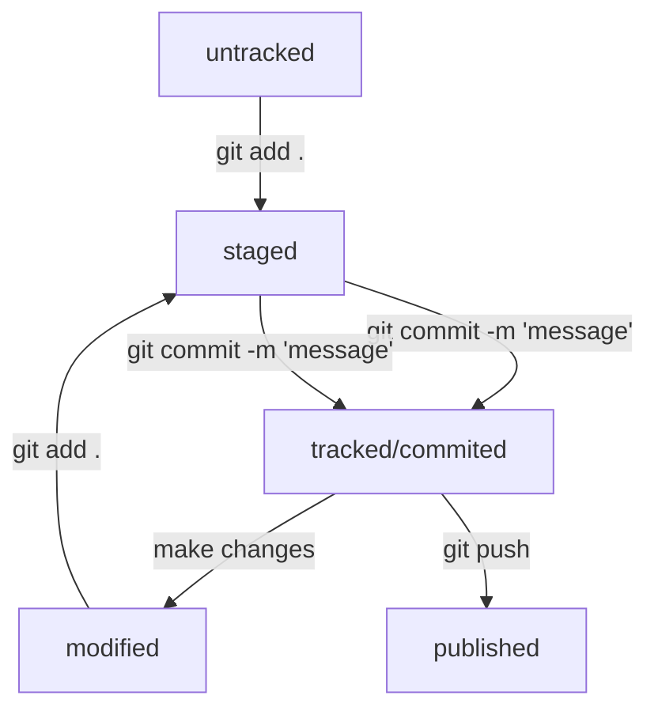

# Git command help file

## Start some git project


```
mkdir yapr && cd yapr  
git init  
git status 
```
**mkdir yapr && cd yapr** -  it'll create project directory  
**git init** - inicialise locale area for git project  
**git status** - show repositary status  

---

## Work with git 

#### After touch or edit some project files in git project directory you can run few commands:<br>

```
git status
git add .
git commit -m "Description of changes"
```
**git status** -  it'll show untracked files  
**git add filename** - Add filename to tracking by git  
**git add --all** - Add all filest in directory to  tracking by git  
**git add .** The same command as a **git add --all** just add all files to project  


After **git add .** use  **git status** to show project status  
Then use **git commit** to fix changes and make a comment  

**git commit -m "Description of changes"**  
if you nead to make some big description skip key **-m** it'll open your default editor, where you can write anything for comment  

**git log** - it'll show history oof commit  


---

## Work with remote repositary

Run **ls -la ~/.ssh** to know have you any ssh keys or no  
if you don't see any ** .pub** you'll nead to create keys.  
Read about [ssh-keygen](https://docs.github.com/ru/authentication/connecting-to-github-with-ssh/generating-a-new-ssh-key-and-adding-it-to-the-ssh-agent)  


On your local mashine run:  
```
For MAC: 
pbcopy < ~/.ssh/id_rsa.pub  
or unix:  
cat  ~/.ssh/id_rsa.pub  
and copy result   
```
If you use MAC:  
**pbcopy < ~/.ssh/id_rsa.pub** this command will copy **~/.ssh/id_rsa.pub**  
or unix: 
**cat  ~/.ssh/id_rsa.pub** and copy result  
for Windows [install Git for Windows](https://git-scm.com/download/win) and folow instruction  

On the github.com go to your profile setting,  
SSH and GPG keys and run **New SSH key** green button.  
Past your public key and add some description.  
To Check connection result run: <br>
```
ssh -T git@github.com  
```
**ssh -T git@github.com** - check connection to github.com by ssh   
You'll see someting like: 
```
*Hi **YouName**! You've successfully authenticated, but GitHub does not provide shell access.*  
```
It means that everything is ok.

---

## Send your project to remote repositary
Create new project on the github.com, like the same on a local mashine **yapr**  
Run green button **Code** then Local-Clone choose SSH and copy URL like:  
*git@github.com:**YouName**/yapr.git*  

On a local mashine run few commands:  
```
git remote add origin git@github.com:**YouName**/yapr.git 
git remote -v  
git branch -M main 
git push -u origin main 
```


**git remote add origin git@github.com:YouName/yapr.giti** - It'll set remote repositary  
**git remote -v** - Show connected repositary  
**git branch -M main** - Set branch name  
**git push -u origin main** - Send your files on a github.com  

---

#### Fore more information

Read documentation [Git Book](https://git-scm.com/book/en/v2) for git.  
Try to use quick lesons [GitHowTo](https://githowto.com) .  
Use [yandex lesons](https://practicum.yandex.ru), it's free.


---

# Something about Git files

## How to see status

**git log** - show history of commit:  
```
commit 834ff576eefdcc5eb7079b606d7ea69cb74a2170 (HEAD -> main, origin/main)
Author: rayne <rayne@mail.ru>
Date:   Sun Aug 13 15:09:51 2023 +0300

    feet: Add info git lof --online
```
where **commit** contained hash id wich generated by **SHA1**  
and argument HEAD said that it was last commit  

**cat refs/heads/main**  
834ff576eefdcc5eb7079b606d7ea69cb74a2170  
show the same hash  

**git log --oneline** - show A short info about commits    
```
e098927 feet: Add info about log
7dacdd1  Fix README.mb final
cba9fdc  Fix README.mb final
e5b6696  Fix README.mb 09
1a131e5  Fix README.mb 08
361883c  Fix README.mb 07
952d6ac  Fix README.mb 06
c14f093  Fix README.mb 05
198d978  Fix README.mb 04
42b6083  Fix README.mb 03
76e6a85  Fix README.mb 02
8da2b26  Fix README.mb 01
57b8ebe Change readme
```

## Git files life cycle 

File could be:   
**untracked** - when you just add or create new file **touch filename.txt**  
**staged**  - when you run **git add filename.txt**  
**tracked**  - when you run **git commit -m "message"**  
**modified**  - when you make some changes after commit


And the same but vertical:  



© 2023 rayne


